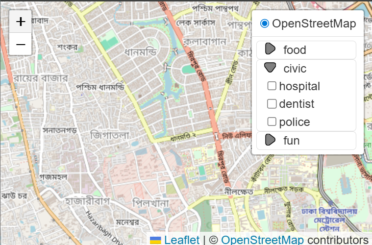

# Leaflet-LayersTree
Layer Control that can optionally group layers in a tree-style view.
Simply decorate the Leaflet Layer object with an "\_LTgroup" member 
where the value is the name of the group you'd like displayed.  Layers
that are not decorated get added to the Layer Control like normal, 
decorated layers get added to the named group.

It does not currently handle nested trees.


See the [demo](https://almamigratoria-netizen.github.io/Leaflet-LayersTree/)

# Usage Example
```js
    // treeCollapsed defaults to true
    new LayersTree({treeCollapsed: false}).addTo(map);
```

# Options
In addition to the normal Control Layers options, you can specify
'treeCollapsed' as true or false to set the initial state of the
treeviews.

# License
MIT


#
